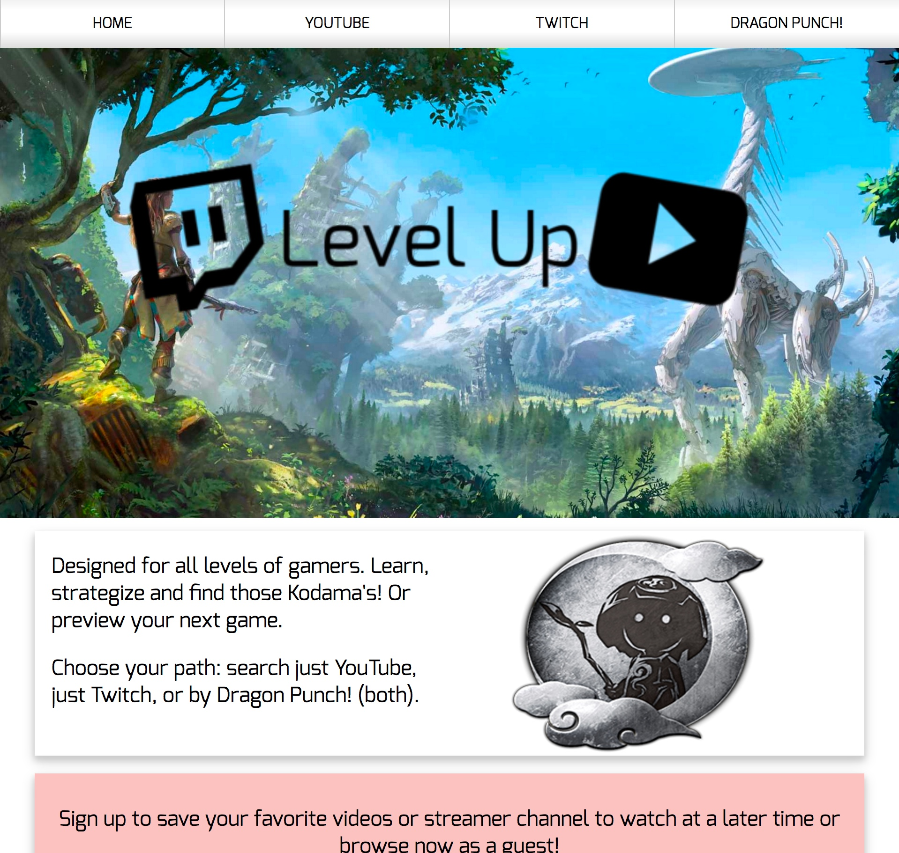
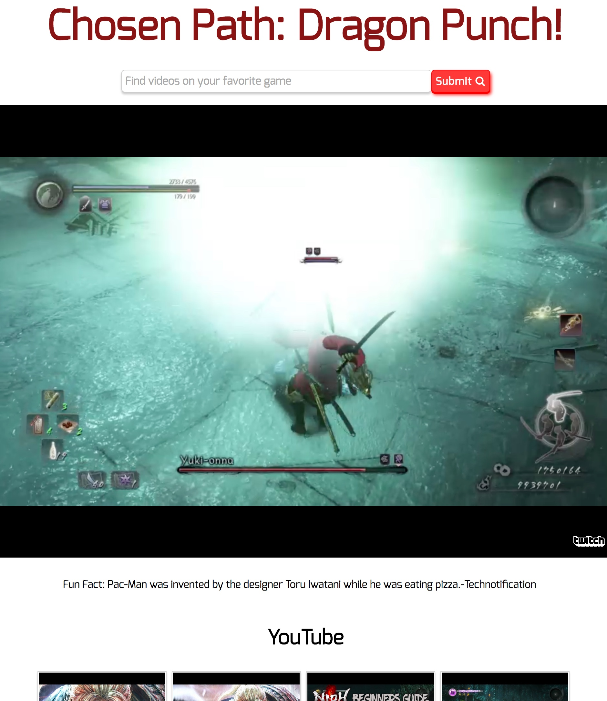

# Welcome to Level Up! [](https://travis-ci.org/navkelley/levelUp)

Level Up exists because I love gaming. Unfortunately, I am horrible at it! I am the type of person who will drive the ball the wrong way (Rocket League) or run around with no idea where I'm supposed to go! I then search for videos to help me or use twitch to see how others are doing. It's cumbersome to have many sites up with different videos playing, and if you forget which tab is playing you could have competing sound, so Level Up was created to assist all gaming enthusiasts. 

Level Up demonstrates the use of frontend frameworks such as React and Redux to transform data from YouTube and Twitch. The user has the ability to search just one platform or both simultaneously (known as the Dragon Punch)!
Users have the ability to play videos or streams directly within the app to provide a convience feature that is to be desired by gaming enthusiasts. You can try the demo [here!](https://level-up-gamer.herokuapp.com/#/)   

## Getting Started

These instructions will get you a copy of the project up and running on your local machine for development and testing purposes.

### Installing

To begin installation of Baby Steps first fork the repo then click the button titled "Clone or download" inside of your version of the repo.

In your terminal (in the desired directory) type:
```
git clone [link of repo]
```
And make sure to install all dependencies with
```
yarn install 
```
Also you will want to ensure that you have a database setup locally by either installing MongoDB or if you already have MongoDB installed follow these steps: 
```
cd backend 
mongod
``` 
Finally, start the server 
```
yarn start
```
Now you are ready to go! 

## Screenshots




## Development Roadmap
* Add ability to save videos/streams to account
* User login/authentication 
* Change background to match theme

## Built With
* [React](https://facebook.github.io/react/) 
* [Redux](http://redux.js.org/) 
* Heroku 
* [Webpack](http://webpack.github.io/docs/tutorials/getting-started/)
* [Babel](https://babeljs.io/) 

## Authors

* **[Nicole Kelley](https:www.nicolevkelley.com)**

## Acknowledgments

* Stephen Grider-For Udemy Course explaining React/Redux and providing an excellent scaffolding example
* YouTube-For allowing use of their API for developers
* Twitch-For allowing use of their API for developers
